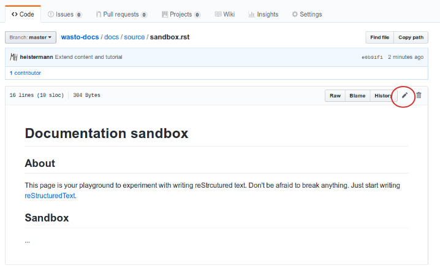
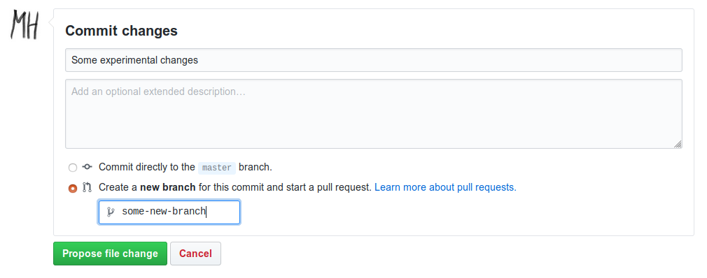
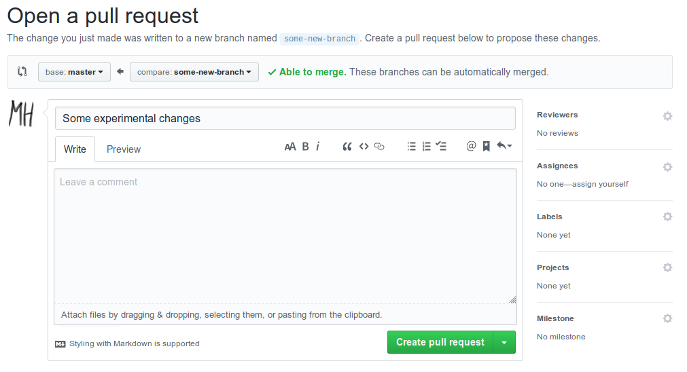
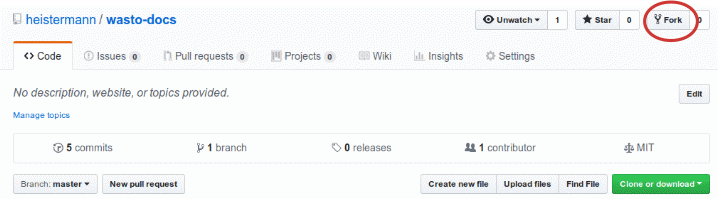

How to write the docs?
======================

Quick intro
-----------

This page gets you started for contributing to the doc pages.

The docs are written in `reStructuredText <http://www.sphinx-doc.org/en/master/usage/restructuredtext/basics.html>`_ -
an easy-to-learn markup language. So adding or editing content basically means
writing rst documents in a simple text editor.

The sources are available in `this GitHub repository <https://github.com/heistermann/wasto-docs>`_.
If these sources are modified through a new "commit", a new doc version is built
and hosted via https://readthedocs.org/ and shown at https://wasto-docs.readthedocs.io.

Building the docs is done with a software named `Sphinx <http://www.sphinx-doc.org>`_.
But let's hear about that later.

The quickest way to get started is editing the docs directly in GitHub.
Let's try that first. If you do not have a GitHub account, yet, get it
`here <https://github.com>`_, then log in.

We have prepared a sandbox document for you to play around and experiment.
Open your browser `here <https://github.com/heistermann/wasto-docs/blob/master/docs/source/sandbox.rst>`_,
then hit the ``edit`` button.

Now you can edit the content. Just experiment in the ``sandbox`` section -
it does not have to make sense. After you're done, move down to "Commit changes",
enter some commit message, and choose the ``Create new branch...`` option,
then hit ``Propose file change``.

If you have write permissions, you can also choose the ``Commit directly to
the master branch`` option, but it is considered good practice to do this
via a so called *Pull request*. You will be redirected to a new page where
you can then hit ``Create pull request``.

You now need to wait for the maintainer to accept your change. Otherwise, you can also merge the
changes yourself. You can monitor the accceptance status of your pull request
`here <https://github.com/heistermann/wasto-docs/pulls>`_. In case you have
write permissions, you can also merge it yourself.

Once your pull request is accepted, it will take a couple of minutes and
the result will be rendered at https://wasto-docs.readthedocs.io/en/latest/sandbox.html.

In the section `Edit and build the docs locally`_, you will learn how to edit
the docs locally before submitting a pull request. Until then, you can continue
to edit online. You can also create files using the ``Create file`` button, or
delete files using the trash bin button.

In the next step, we will learn more about the directory and document structure.

Directory structure and TOC trees
---------------------------------

The directory structure is as follows::

  docs
    source
       _static
       some_folder
       ...
       some_file.rst
       ...
       conf.py
       ...
       index.rst
       sandbox.rst
       usethedocs.rst
       writethedocs.rst
       ...
    make.bat
    Makefile

Our entry point always is the ``index.rst`` file::

  Some header
  ===========

  Some content...

  .. toctree::
    :maxdepth: 2
    :caption: Contents:

    writethedocs
    usethedocs
    ...
    crns
    chromatography
    sandbox

  ...

The key element in ``index.rst`` is the ``toctree`` (**t**\ able \ **o**\ f **c**\ ontent).
Here you specify all the high-level ``rst`` files that should be included in
the documentation, as well as their order. If you have a look at the raw
`index.rst <https://raw.githubusercontent.com/heistermann/wasto-docs/master/docs/source/index.rst>`_
content, you will notice that the order of the entries below the ``toctree`` directive
corresponds to the navigation sidebar on https://wasto-docs.readthedocs.io,
as well as to the TOC tree shown on the `start page <https://wasto-docs.readthedocs.io>`_.
However, you will notice that the ``rst`` file extension has been dropped.
Furthermore, the actual TOC tree is not composed of the file names themselves,
but of their top-level headers.

So what do you do if you want to add a new ``rst`` file as a new high-level
element of your TOC tree. Suppose we create a new file ``new_chapter.rst``
in the ``source`` directory. We can add some content to that file::

  New chapter header
  ==================

  Some content...

To make sure that this file appears in our docs, we need to add it to some
``toctree`` directive, typically, but not necessarily, in the ``index.rst``::

  .. toctree::
    :maxdepth: 2
    :caption: Contents:

    writethedocs
    usethedocs
    ...
    crns
    chromatography
    sandbox
    new_chapter

Edit and build the docs locally
-------------------------------

Install local build environment
...............................

Sphinx collects all the raw source code and puts it together
to beautiful html pages, pdfs, epubs and more. Usually, you would not edit
the source files on GitHub (like above). Instead, you would edit them locally,
and then push the new version to the GitHub repository. To achieve this,
you need to install two things: the git client, and Sphinx. There are endless
ways to achieve this, but we suggest the following, using the conda package
manager which works on most platforms (Linux, OSX, Windows).

Please follow these steps::

1. Install Miniconda (https://conda.io/miniconda.html).

2. Create a new ``conda`` environment::

      $ conda create --name buildthedocs python=3.7

4. Activate the new environment::

    **Linux**

    $ source activate sphinx

    **Windows**

    > activate sphinx

5. Install dependencies::

      (buildthedocs) $ conda install sphinx sphinx_rtd_theme git

Done!

Clone the repository
....................

Before cloning the repository to your local machine, we create a kind of
copy on GitHub on which you have full permissions. It is called a "fork". Just go
`here <https://github.com/heistermann/wasto-docs>`_, hit the ``fork`` button,
and follow through.

Now move to any directory where you want the docs to land, open a terminal
(or DOS-console on Windows), and go as follows::

  $ activate buildthedocs
  (buildthedocs) $ git clone https://github.com/YOUR-ACCOUNT/wasto-docs.git
  (buildthedocs) $ cd wasto-docs

.. warning::

  Windows users need to use ``activate`` instead of ``source activate``.

Using your file manager, you should see that all the files are there in a
new directory.

Edit and build the docs
.......................

You can now edit the files locally using any text editor (for Windows,
Notepad++ is a good one, and https://atom.io/ is, too). If you want to test
whether everything builds fine, open a terminal or DOS window in the
``docs`` directory and do::

  $ activate buildthedocs
  (buildthedocs) $ make html

This will trigger some verbose terminal activity which is Sphinx at work. Hope it
ends with ``build succeeded``. Now look for the ``inde.html`` file in the directory
``docs/build`` and open it with your browser. Did it work?

Get the changes online!
.......................

If the docs build fine, you want the changes to go where everything came from.

This is not a fundamental git intro, so we stick to what's necessary:
The mechanism for this is called "Pull request" and it looks like this::

  (buildthedocs) $ git add .
  (buildthedocs) $ git commit -m "Some informative commit message"
  (buildthedocs) $ git push origin master
  Username for 'https://github.com': YOUR-ACCOUNT
  Password for 'https://heistermann@github.com': YOUR-PASSWORD

Have a look at https://github.com/YOUR-ACCOUNT/wasto-docs: Do you seee how your
changes arrived? Now you're almost there. Hit the `New pull request`` button
and follow through. Once your pull request is merged by someone with write
permissions, your edits will appear in the online docs.

Advanced git which makes life easier
....................................

To appear soon...
